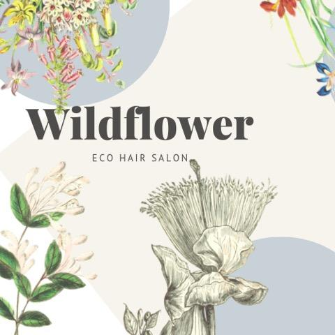
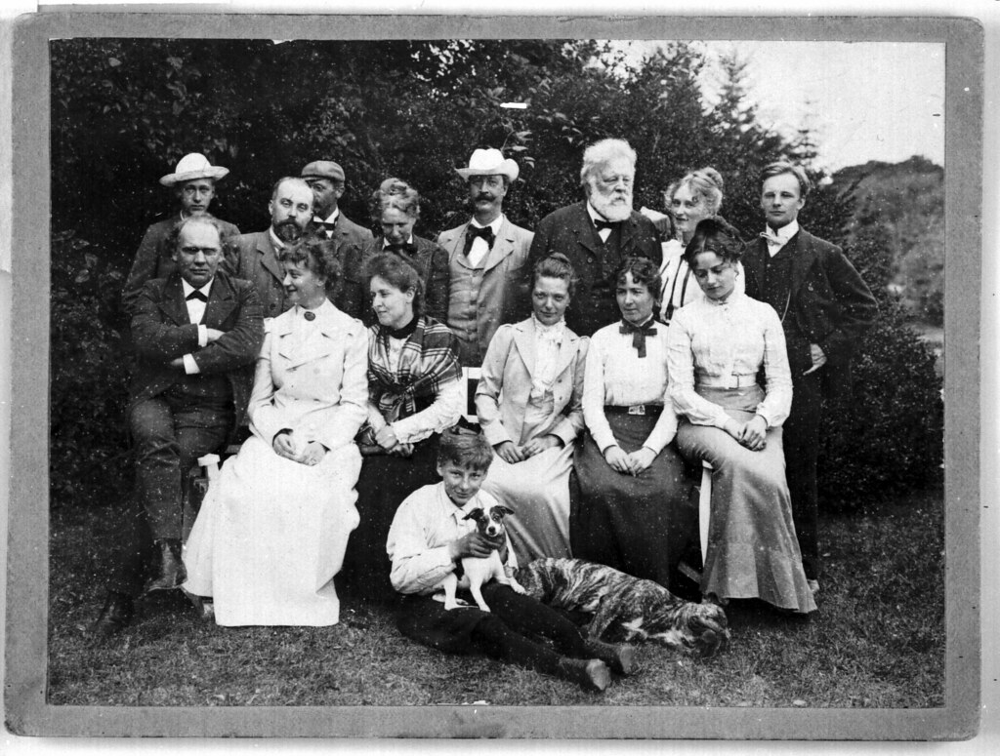

---
# Feel free to add content and custom Front Matter to this file.
# To modify the layout, see https://jekyllrb.com/docs/themes/#overriding-theme-defaults

layout: default
title: Wildflower Salon
---
<main role="main" class="container text-center">
    

        
        <!-- <h1 class="mt5 playfair-bold">Wildflower Salon</h1> -->
        <h3>An Eco Salon in Northeast Minneapolis</h3>
        <a class="btn btn-lg btn-dark m-3 text-light">Book Now</a>
        
This is where I'm gonna tell you the most relevant information the most quickly. I'll probably have a big button to go book a service right away in case that's all I came here for.

        
    
      
</main>